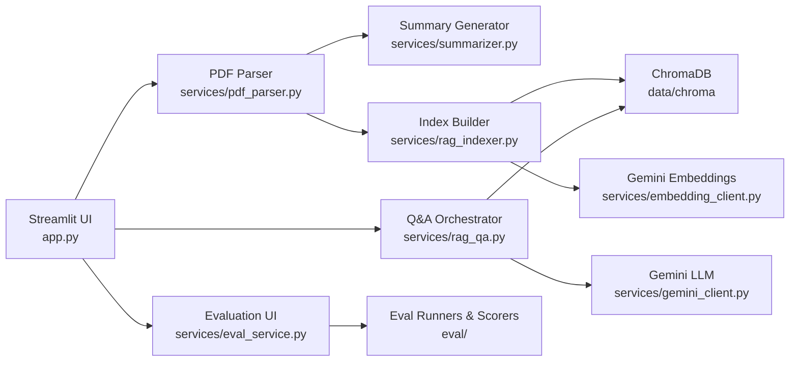

# PaperScope AI

PaperScope AI is a Streamlit app that summarizes crypto whitepapers, enables
retrieval‑augmented Q&A, and evaluates both outputs for factual grounding and
format compliance.

## Features

- PDF upload and text extraction with PyMuPDF
- Structured summary generation with Gemini
- Retrieval‑augmented Q&A with citations to page and section
- Built‑in evaluation for summary and Q&A quality

## Architecture



### Component Notes

- **`app.py`**: Streamlit UI, session state, and tab flow.
- **`services/pdf_parser.py`**: Extracts full text and per‑page text.
- **`services/sectionizer.py`**: Heuristic heading detection for section labels.
- **`services/rag_indexer.py`**: Chunks pages, embeds them, and stores in Chroma.
- **`services/rag_qa.py`**: Retrieves chunks, applies guardrails, and prompts LLM.
- **`services/summarizer.py`**: Runs summary prompt and filters banned language.
- **`services/gemini_client.py`**: LLM text generation client.
- **`services/embedding_client.py`**: Embedding client for retrieval.
- **`services/eval_service.py`** + **`eval/`**: Summary/Q&A evaluation logic.

## Retrieval‑Augmented Generation (RAG)

The Q&A flow uses RAG to keep answers grounded in the whitepaper text:

1. **Chunking**: Each page is chunked with overlap and tagged with a section.
2. **Embedding**: Each chunk is embedded using Gemini embeddings.
3. **Indexing**: Embeddings and metadata are stored in a persistent ChromaDB.
4. **Retrieval**: User question is embedded and the top‑k chunks are retrieved.
5. **Guardrails**: If retrieval is weak, the app returns:
   `"Information not found in the document."`
6. **Answering**: The LLM receives only retrieved chunks plus recent chat history.
7. **Citations**: Responses must include `Page` and `Section` references.

This keeps answers anchored to evidence and makes evaluations deterministic.

## Project Structure

```
.
├── app.py
├── services/
│   ├── embedding_client.py
│   ├── eval_service.py
│   ├── gemini_client.py
│   ├── pdf_parser.py
│   ├── rag_indexer.py
│   ├── rag_qa.py
│   ├── sectionizer.py
│   └── summarizer.py
├── prompts/
│   ├── mvp2_qa_system_prompt.txt
│   └── summary_system_prompt.txt
├── eval/
│   ├── judge.py
│   ├── runner.py
│   ├── schemas.py
│   └── scorers.py
└── requirements.txt
```

## Setup

### 1. Install dependencies

```bash
python -m venv .venv
source .venv/bin/activate
pip install -r requirements.txt
```

### 2. Configure environment

Create a `.env` file (or export the variable) with your Gemini API key:

```
GEMINI_API_KEY=your_key_here
```

### 3. Run the app

```bash
streamlit run app.py
```

## Usage

1. Upload a PDF whitepaper.
2. Generate a summary in the **Summary** tab.
3. Build the Q&A index in the **Q&A** tab.
4. Ask questions with evidence‑backed citations.
5. Evaluate outputs in the **Evaluation** tab.

## Evaluation

The evaluation suite checks:

- **Summary**: Required sections, length, and “missing info” phrasing.
- **Q&A**: Structure, reference format, reference validity, and numeric grounding.

Use the **Gemini Judge** toggle for deeper semantic checks.

## Configuration Notes

- ChromaDB is pinned to `0.3.23` to avoid `onnxruntime` on Python 3.14.
- `google-generativeai` is used for compatibility with `pydantic<2`.
- Persistent vector data is stored in `data/chroma/`.

## License

Add your preferred license here.
